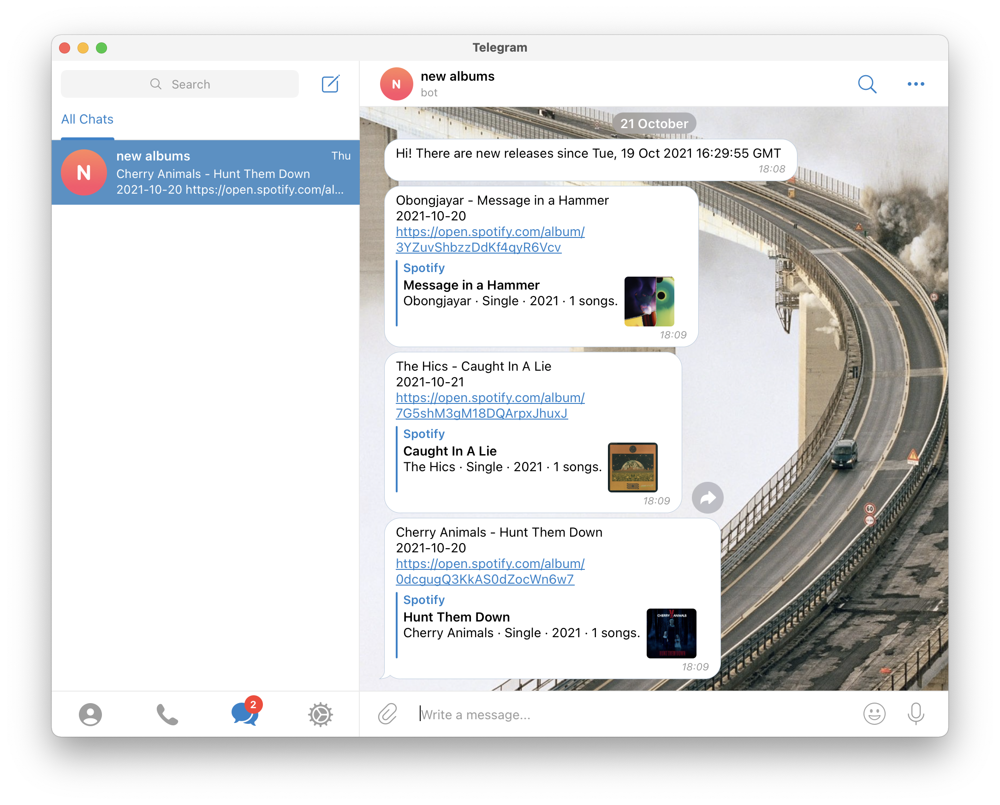
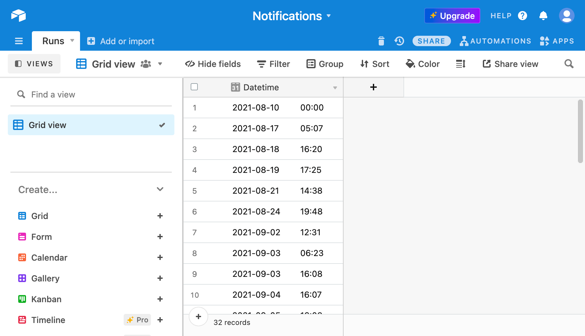
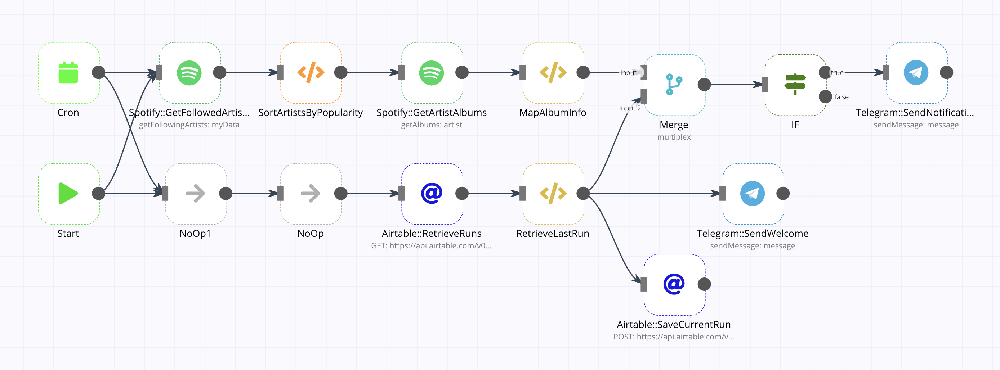

# new-releases

n8n workflow for telegram notifications about new releases

## Setup

### Prerequisites

- [n8n running as system service](https://n8n.io/blog/how-to-set-up-n8n-via-pm2/)
- [Spotify](https://www.spotify.com/) account
- [Telegram bot](https://core.telegram.org/bots#3-how-do-i-create-a-bot)
- [Airtable](https://airtable.com/) account with table like this:

### Variables

In order to start, you need to replace following variables in workflow file (`notifications.json`):

| Variable               | Description                                       |
| ---                    | ---                                               |
| `$AIRTABLE_TABLE_ID`   | Airtable ID for table of previous runs timestamps |
| `$AIRTABLE_SHEET_NAME` | Airtable sheet name in given table                |
| `$TELEGRAM_CHAT_ID`    | Telegram bot's chat ID                            |

You may also want to update Cron node with another frequency of updates. Currently it is set up for each Tuesday, Thursday and Saturday. Please note that most of releases are usually done on Fridays.

### Authorizations

You also need to set up 3 API authorizations:

- Spotify, to retrieve data about your followed artists
- Airtable, to retrieve and store data between runs
- Telegram, to connect with bot API

